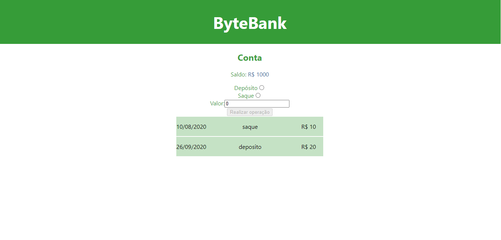

<h1 align="center">
  
</h1>

# Teste com react

Nesta aplicação, o curso abordou sobre teste de funções de regra de negócio, teste de componente de UI e teste unitário.

## React Testing Library

O React Testing Library surgiu com uma abordagem centrada no usuário e com padrões para enfatizar boas práticas de semântica e acessibilidade.

Hoje faz parte do pacote padrão de uma aplicação feita com o Create React App, por isso foi usada nesta aplicação.

O framework Jest já vem instalado e configurado por padrão nos projetos iniciados com Create React App.

Ao rodar o comando `npm test`, a aplicação entrará no modo watch, e toda vez que você alterar algo no seu código, ele rodará os testes novamente.

Os arquivos de testes tem a extensão .test.js.

`describe` é uma função de agrupamento lógico. Segundo a documentação, isso não é necessário e nem recomendado.

Porém no curso essa função foi utilizada para descrever melhor cada cenário de teste.

`it` ou `test` são blocos com o nome do teste e seu código.

`expect` é uma função global para fazer asserções.

Deve-se haver a separação entre implementação da função e o teste.

Criar vários casos de teste ajuda para que o valor esteja correto em vários cenários.

Função pura não muda qualquer estado na aplicação, ela precisa sempre gerar o mesmo resultado com os mesmos argumentos, ela não depende de nenhum fator externo ou faz alterações globais na aplicação e temos a previsão do resultado para poder escrever um teste unitário.

## Teste com snapshot

Teste de snapshot é uma ferramenta para garantir que a interface do usuário (UI)não seja alterada inesperadamente.

`toMatchSnapshot` é uma função para comparar o snapshot criado.

`container.firstChild` é o elemento raiz do elemento renderizado.

Na primeira execução do teste, o terminal aponta para um novo snapshot escrito e cria uma pasta com o arquivo snapshot em JSON.

Toda vez que eu rodar o teste novamente, haverá uma checagem se o novo snapshot é igual ao primeiro e o terminal só avisará se o teste passou ou não.

Clicando na tecla `u` para update, atualizamos o snapshot propositalmente.

## Eventos de disparo

Podemos simular a realização de alguns comportamentos na aplicação, como as transações, usando o `fireEvent`.

- [Lista eventos suportados](https://github.com/testing-library/dom-testing-library/blob/main/src/event-map.js)

## Desafio 1

- Modificar a função calcularNovoSaldo.
- Quando o valor de saque for maior que o saldo, o valor de saldo não deve ser modificado.

## Renderização de componentes

O render é uma função que vai inicializar nosso componente para ser testado. Ela vai renderizar o componente deixando ele pronto para que consigamos acessar as propriedades, os valores, executar funções nele.

O screen é um objeto que vai trazer para nós tudo que o render vai oferecer, com ele vamos acessar essas funções (getByText, getByTestId, getByLabelText), vamos acessar os componentes html, vamos acessar tudo que precisamos para executar nosso teste.

Dessa forma deixamos a renderização do app isolada e não precisamos usar a desestruturação de objeto.

## Queries

Podemos consultar a documentação para sabermos sobre todos os tipos de busca de elementos, o que eles retornam e também as possibilidades de uso.

- [Consultas de elementos](https://testing-library.com/docs/dom-testing-library/cheatsheet)
- [Tipos e Uso](https://testing-library.com/docs/queries/about/#queries)

## Simulação do retorno de API

Na aplicação, testamos o carregamento da lista de transações e usamos a query findByText para encontrar a palavra 'saque' na lista. Após isso, testamos se existiam 2 transações da lista.

A query `findBy`retorna uma promise que é completada quando o elemento é encontrado, dessa forma nosso teste espera até que o componente esteja disponível.

As funções simuladas possuem a propriedade `.mock` que é onde os dados sobre como a função foi chamada e o que a função retornada são mantidos.

Podemos fornecer o `mockResolvedValue` para retornar os dados que queremos que nosso teste confirme.

## Simulação de uma função

`Spy` é uma forma de criar uma simulação de função e ver se ela foi chamada de fato.

Usamos o `jest.fn()`, para criar esse mock.

O método `toHaveBeenCalled` verifica se uma função foi executada pelo menos 1 vez.

Podemos usar um mock de função para saber quando:

- Uma função foi chamada - `expect(mockFuncao).toHaveBeenCalled()`
- Uma função não foi chamada - `expect(mockFuncao).not.toHaveBeenCalled()`
- Quantas vezes uma função foi chamada - `expect(mockFuncao).toHaveBeenCalledTimes(quantidade)`.

## Desafio 2:

- Modificar o código para desabilitar o botão enquanto o form não estiver preenchido (com o valor e o tipo de transação).
- Enquanto o formulário não estiver preenchido não deve chamar a função de atualizar valores.

## Tipos de testes

Teste unitário - teste de funções, módulos, componentes e até snapshots.

Teste de integração - como a requisição está sendo feita pelo backend,
como a conexão com o banco de dados está se comportando e como o conjunto de componentes trabalham em conjunto.

Testes e2e (end to end) - testa o fluxo inteiro da aplicação, que simularia na ui, visualmente, fazendo saque, depósito, carregar o feed, atualizar a página.

POCs - prova de conceito, para saber se vale a pena o esforço e o tempo de criar testes ou se é um código descartável.

Entre os códigos considerados descartáveis,estão as landing pages estáticas sem comunicação com o backend e sem lógica de negócio,
campanhas de marketing temporárias, protótipos que não serão disponibilizados na produção.

Por outro lado, podemos ter utilitários ou um teste a/b que muda um fluxo importante na aplicação que devemos considerar a testagem.

Teste A/B - é um método de teste de design através do qual comparam-se elementos aleatórios com duas variantes, em que estes são o controle e o tratamento de uma experiência controlada, com o objetivo de medir qual das versões apresenta maior taxa de conversão/ aprovação.

## Novas abordagens

`user-event` que é uma abstração do fireEvent para simular interações dos eventos reais que aconteceriam no navegador conforme a interação do usuário, essa abordagem foi citada no fórum da Alura, porém não foi explicada.

## Para rodar a aplicação:

```bash
# Clone este repositório
$ git clone <https://github.com/Alice7H/react-testes.git>

# Acesse a pasta do projeto no terminal/cmd
$ cd react-testes

# Instale as dependências
$ npm install

# Execute o servidor
$ npm run backend

# Execute a aplicação
$ npm start

# Execute o teste
$ npm test

# O servidor iniciará na porta 3001
# O projeto inciará na porta:3000 - acesse <http://localhost:3000>
```
